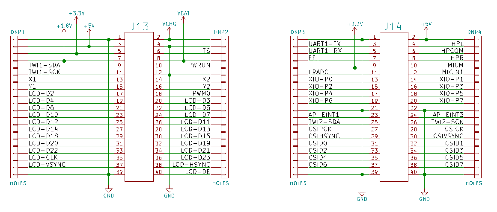
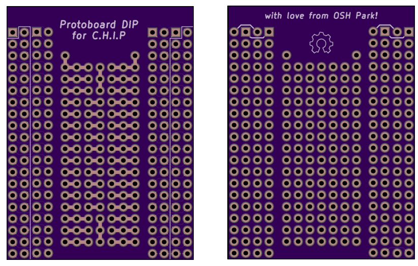
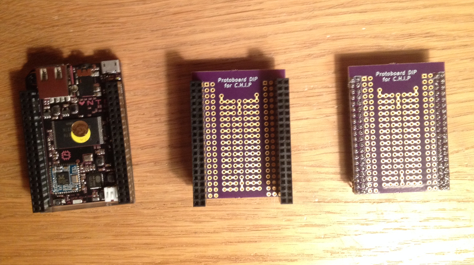
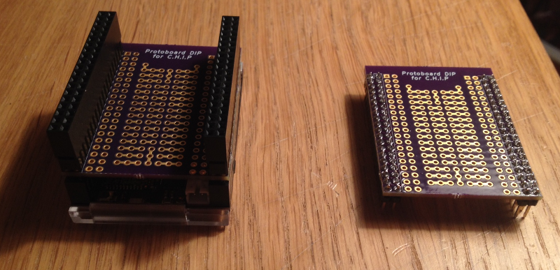
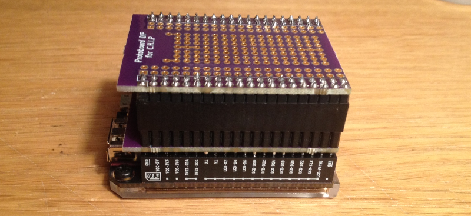
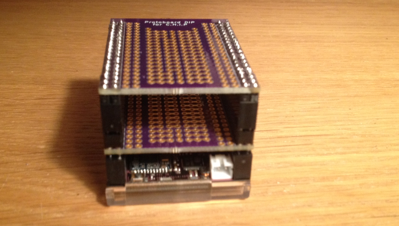
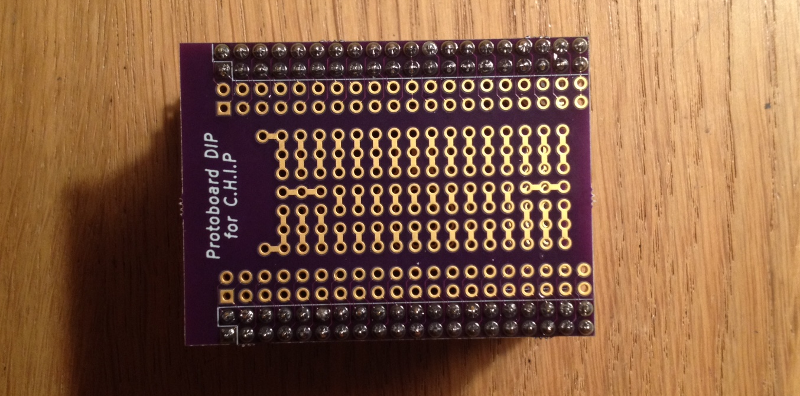

# DIP Protoboard for CHIP

This is a simple protoboard DIP daughter board for when you need something more durable than a breadboard.

## Design

This project was created using the <a href="https://github.com/wickerbox/wickerlib/tree/master/templates/chip-dip-shield">CHIP DIP KiCad template</a> from Wickerlib. 

The protoboard holes are connected where indicated by exposed copper, for easier wire routing and soldering.  

## Bill of Materials

Buying bare boards from OSH Park costs $17.50 for a set of three. I've <a href="https://oshpark.com/shared_projects/sN7i0l9V">shared the boards at OSH Park</a>. You can buy a set of three for $17.50. You'll want to buy the headers separately.

For a non-stackable version, you can just use two standard 0.1" (2.54mm) pitch 1x40 headers, each snapped in half. 

For a stackable version, you can use two of these extra-tall 2x20 female headers <a href="https://www.adafruit.com/products/1979">from Adafruit</a>. The connectors are from the Samtec SSQ family so you could shop around for other distributors, but Adafruit has by far the best price for this particular component. 
